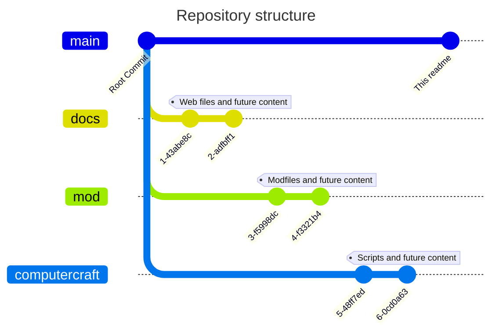

# The Lore of the King God

This repository contains the mod files, scripts and other things found in
the modpack of _The Lore of the King God_, and other assets related to the
official server of the pack.

## Structure

There are three major branches that contain this information (Excluding main):

- The [`mod` branch][mod-b]
  - Contains the _KubeJS_ files that add items to the game.
- The [`docs` branch][docs-b]
  - Contains future web files for further information.
- The [`computercraft` branch][cc-b]
  - Contains _ComputerCraft_ scripts that are being used in the official server.

[mod-b]: https://github.com/sigmasoldi3r/protane-mod/tree/mod#readme
[docs-b]: https://github.com/sigmasoldi3r/protane-mod/tree/docs#readme
[cc-b]: https://github.com/sigmasoldi3r/protane-mod/tree/computercraft#readme

Also there is this `main` branch which is used as a root branch, starting point
and template for future blank branches.

Also contains some documents like this one.
